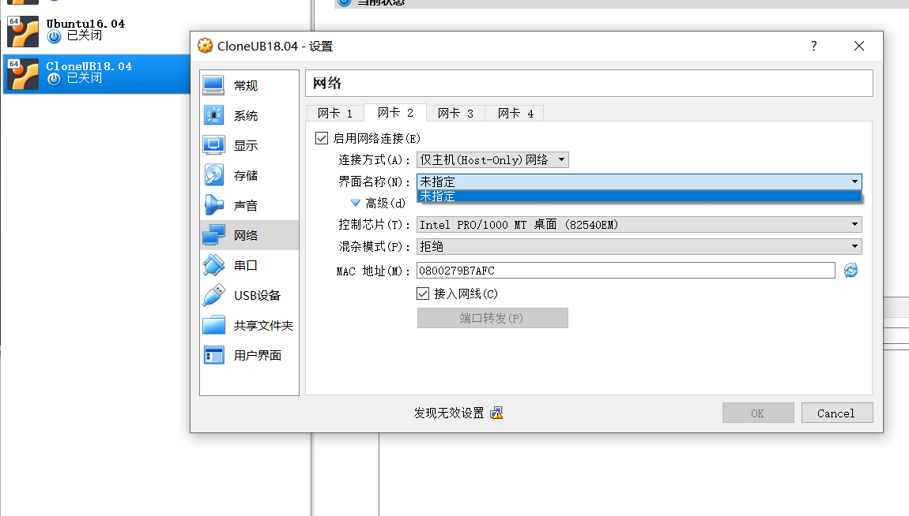
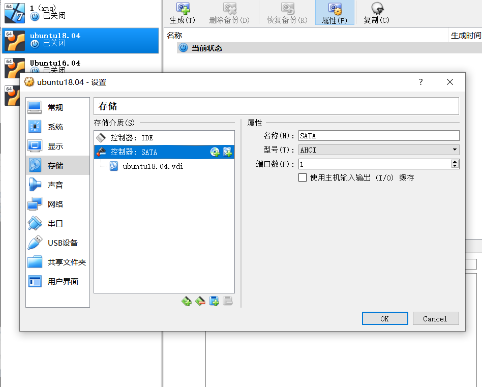
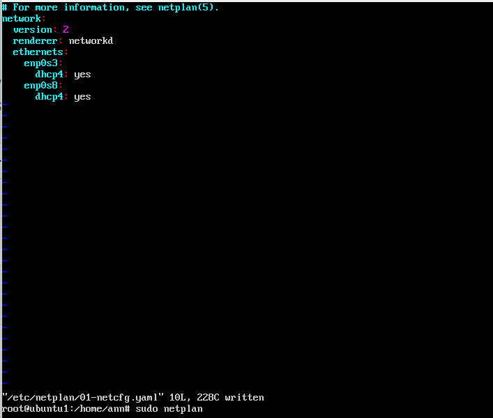
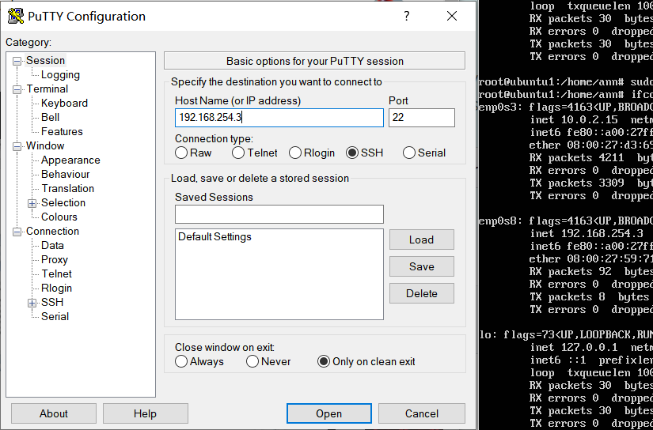
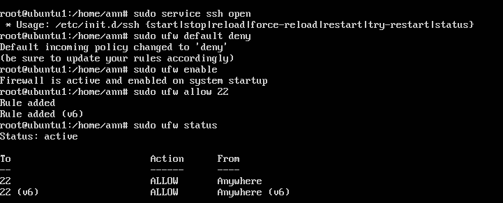
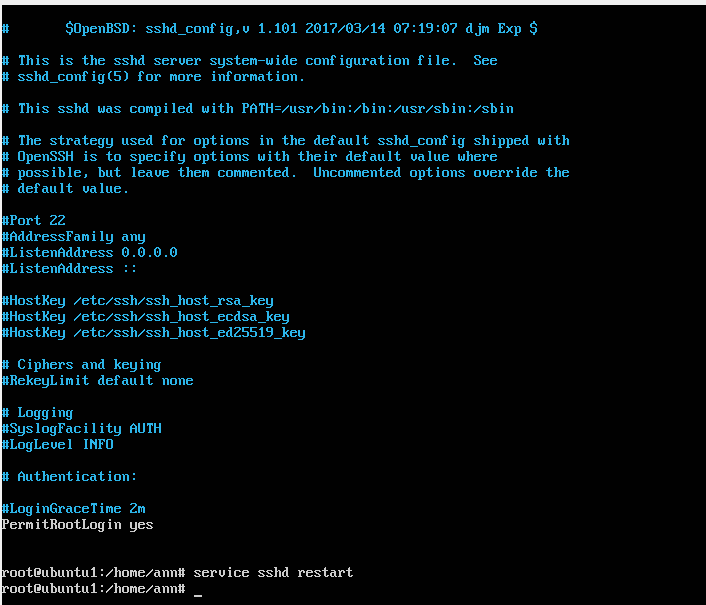
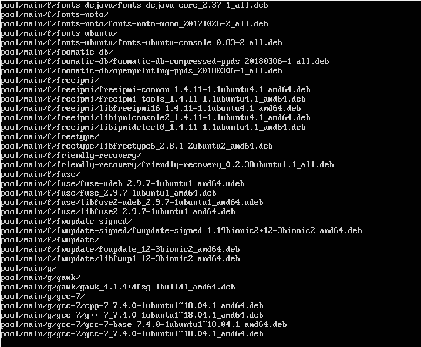
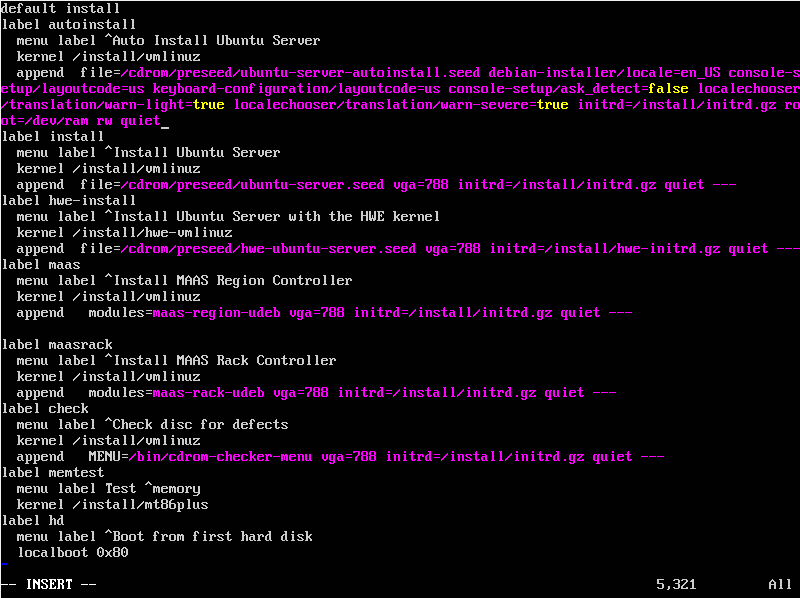
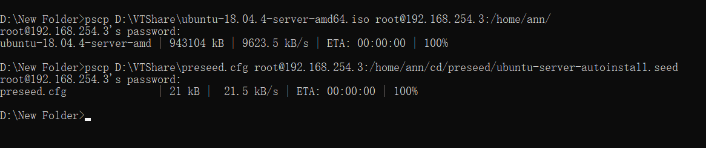
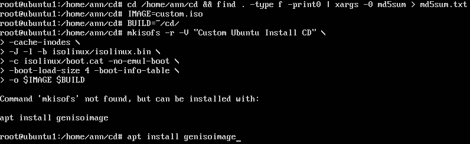

# 无人值守安装iso制作过程
* 验证身份：我的用户名为ann，命令行的图片可验证。
## 实验前准备
* ##### 1.	配置双网卡时，遇到 “界面名称未指定” 的问题，发现此问题已有同学给出了解决办法：在全局工具里配置本机网络管理。配置后问题解决。
  
  

* ##### 2. 备份完后重新挂载硬盘时错将iso文件挂载到光驱里，打开虚拟机时出报错“FATAL:Could not read from the boot medium! System halted，”后来挂载多重加载的硬盘后解决。
   

* ##### 3. 配置双网卡过程
  
   如图添加enp0s8:  dhcp4:yes  
   sudo netplan apply

   
   

* ##### 4. 两块网卡配置成功
   查看：ifconfig
   

## 实验过程
* ##### 5. 连接PUTTY与Ubuntu,并配置以ssh实现ubuntu与WINDOWS文件的互传

  
   连接PUTTY与Ubuntu

  
  打开SSH端口:    
  \$sudo ufw default deny  
  \$sudo ufw enable  
  \$sudo ufw allow ssh
   查看防火墙的状态：    \$sudo ufw status

  
  
  用PUTTY登录时密码没错但登不进去，报错Access denied。修改etc/ssh/sshd_config文件以后成功使用pscp上传文件。  
  修改过程：将图上左下角“ PermitRootLogin "的那行改为“ PermitRootLogin yes ”
  上传：
  pscp D:\VTShare\ubuntu-18.04.4-server-amd64.iso root@192.168.254.3"/home/ann/  

* ##### 6. 挂载iso镜像到loopdir目录下  
  mount -o loop ubuntu-18.04.4-server-amd64.iso loopdir  
 
* ##### 7. 创建一个工作目录用于克隆光盘内容
  mkdir cd  

* ##### 8. 同步光盘内容到目标工作目录
  rsync -av loopdir/ cd
  同步过程如下图
  

* ##### 9.  卸载iso镜像
  umount loopdir
  
* ##### 10. 进入目标工作目录 并编辑Ubuntu安装引导界面增加一个新菜单项入口 
  cd cd/   
  vim isolinux/txt.cfg  
  添加如图文件后强制保存

* ##### 11. 提前阅读并编辑定制Ubuntu官方提供的示例preseed.cfg，并将该文件保存到刚才创建的工作目录  
  ~/cd/preseed/ubuntu-server-autoinstall.seed
  

* ##### 12. 重新生成md5sum.txt 封闭改动后的目录到.iso
  
  cd ~/cd && find . -type f -print0 | xargs -0 md5sum > md5sum.txt
  IMAGE=custom.iso  

  BUILD=~/cd/  
  mkisofs -r -V "Custom Ubuntu Install CD" \   
            -cache-inodes \ 
            -J -l -b isolinux/isolinux.bin \
            -c isolinux/boot.cat -no-emul-boot \
            -boot-load-size 4 -boot-info-table \
            -o \$IMAGE \$BUILD
  
* ##### 还未解决问题
  genisoimage包无法下载，我试着用了apt-get update和apt-get upgrade命令，耗时很长，但是仍然没用。我准备换一下源试试，但是怕时间来不及，所以打算先提交。剩余步骤做完再补交。

#### 参考文件
https://blog.csdn.net/legend050709/article/details/41176947
https://blog.csdn.net/cmzhuang/article/details/80513965
https://blog.csdn.net/qq_43115981/article/details/94763239
https://askubuntu.com/questions/634501/cant-mount-iso-file-as-loop-device-error-failed-to-setup-loop-device
