# 无人值守安装iso制作过程
* 验证身份：我的用户名为ann，命令行的图片可验证。
## 实验前准备
* ##### 1.	配置双网卡时，遇到 “界面名称未指定” 的问题，发现此问题已有同学给出了解决办法：在全局工具里配置本机网络管理。配置后问题解决。
  
  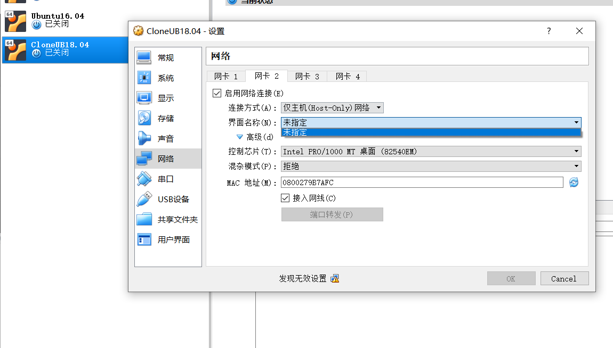

* ##### 2. 备份完后重新挂载硬盘时错将iso文件挂载到光驱里，打开虚拟机时报错“FATAL:Could not read from the boot medium! System halted，”后来挂载多重加载的硬盘后解决。
   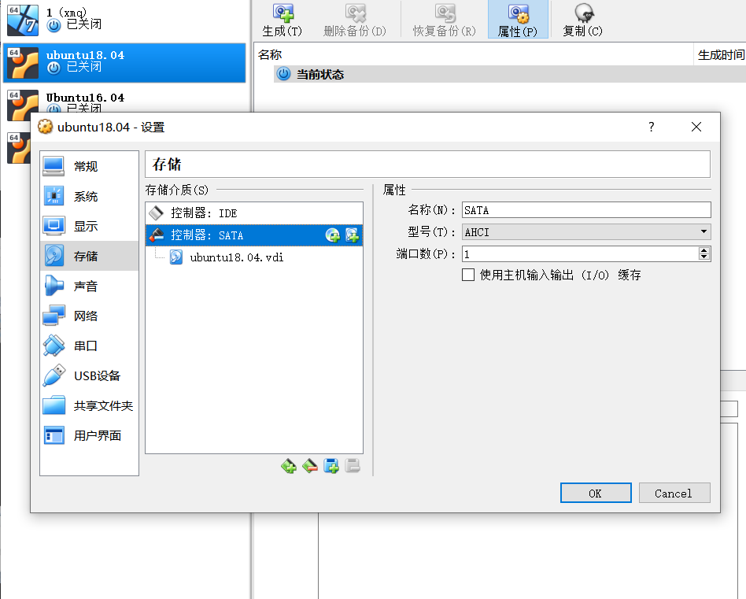

* ##### 3. 配置双网卡过程
  
   如图添加```enp0s8:```  
   ```dhcp4:yes ``` 
   ```sudo netplan apply```


   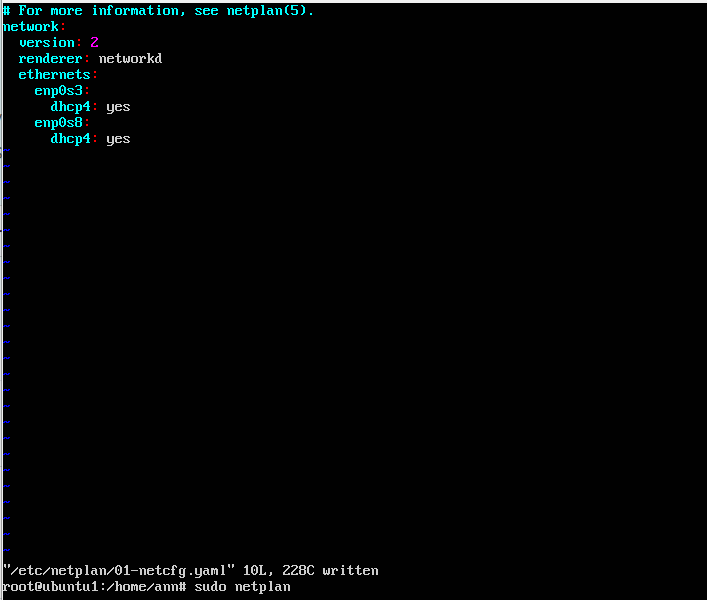
   

* ##### 4. 两块网卡配置成功
   查看：```ifconfig```  
  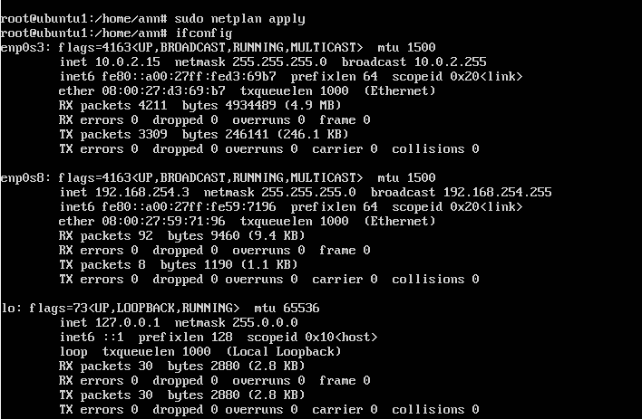

## 实验过程
* ##### 5. 连接PUTTY与Ubuntu,并配置以ssh实现ubuntu与WINDOWS文件的互传

  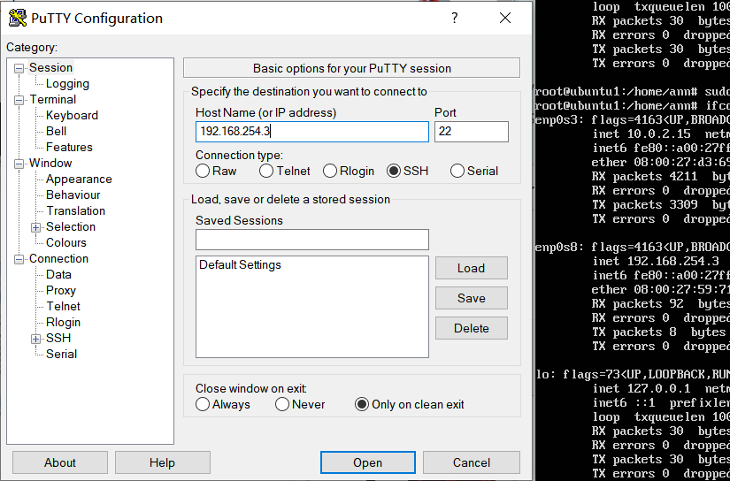
   连接PUTTY与Ubuntu

  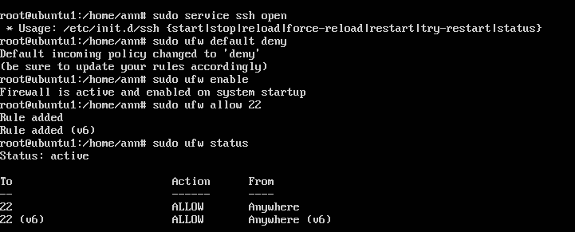
  打开SSH端口:    
  ```\$sudo ufw default deny```  
  ```\$sudo ufw enable```  
  ```\$sudo ufw allow ssh```
  查看防火墙的状态：  
   ```\$sudo ufw status```

  
  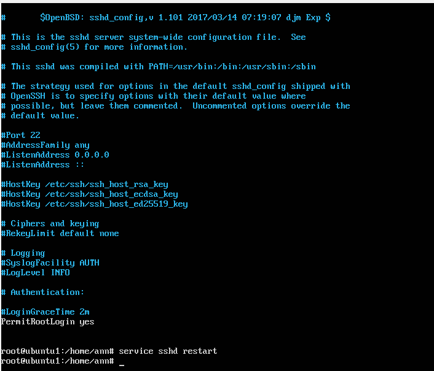
  用PUTTY登录时密码没错但登不进去，报错Access denied。修改etc/ssh/sshd_config文件以后成功使用pscp上传文件。  
  修改过程：将图上左下角“ ```PermitRootLogin ```"的那行改为“ ```PermitRootLogin yes ```”
  上传：
   ``` pscp D:\VTShare\ubuntu-18.04.4-server-amd64.iso root@192.168.254.3:/ ``` 

* ##### 6. 挂载iso镜像到loopdir目录下  
  ```mount -o loop ubuntu-18.04.4-server-amd64.iso loopdir ```   

* ##### 7. 创建一个工作目录用于克隆光盘内容
  ```mkdir cd ```   

* ##### 8. 同步光盘内容到目标工作目录  

  ```rsync -av loopdir/ cd```
  同步过程如下图  
  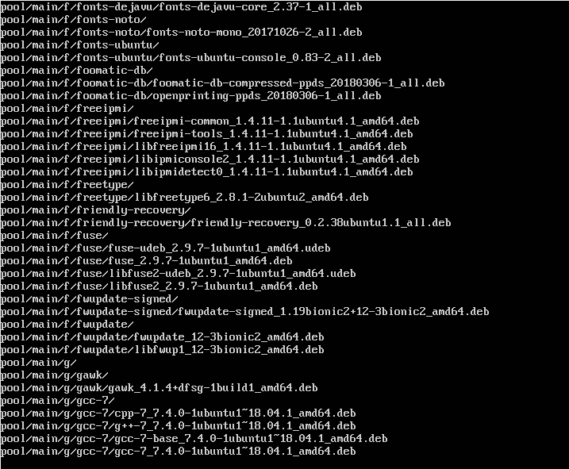  

* ##### 9.  卸载iso镜像
  ```umount loopdir```  

* ##### 10. 进入目标工作目录 并编辑Ubuntu安装引导界面增加一个新菜单项入口  

  ```cd cd/```   
  ```vim isolinux/txt.cfg``` 
  添加如图文件后强制保存

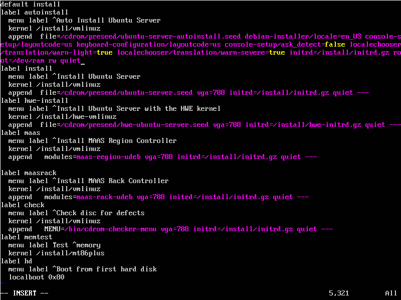

* ##### 11.修改isolinux/isolinux.cfg，增加内容timeout 10  

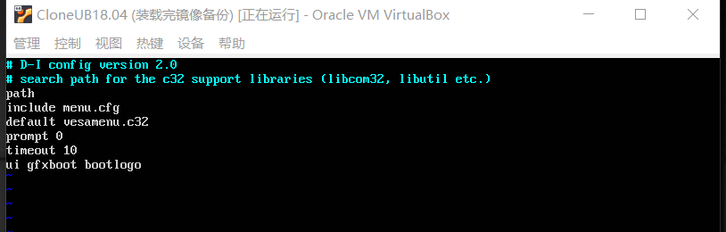  

* ##### 11. 提前阅读并编辑定制文件，并将该文件保存到刚才创建的工作目录  

  ```pscp D:\VTShare\ubuntu-server-autoinstall.seed root@192.168.254.3:cd/preseed```  
  
  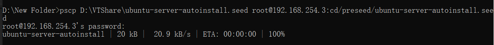  

* ##### 12.下载genisoimage包
  genisoimage包无法下载，我试着用了```apt-get update```和```apt-get upgrade```命令，后来将源换成阿里云的后解决。换源：
  ```vim /etc/apt/sources.list```    
  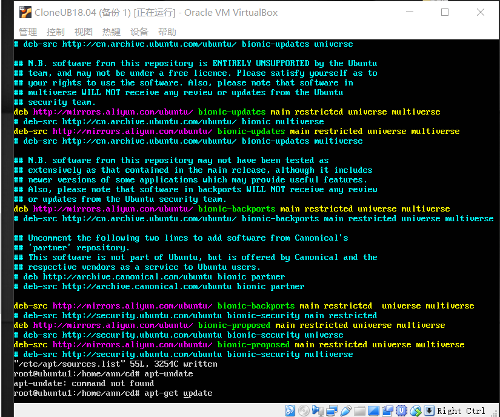  

* ##### 13. 重新生成md5sum.txt 封闭改动后的目录到.iso  
  ``` cd ~/cd && find . -type f -print0 | xargs -0 md5sum > md5sum.txt
  IMAGE=custom.iso  

  BUILD=~/cd/  
  mkisofs -r -V "Custom Ubuntu Install CD" \   
            -cache-inodes \ 
            -J -l -b isolinux/isolinux.bin \
            -c isolinux/boot.cat -no-emul-boot \
            -boot-load-size 4 -boot-info-table \
            -o \$IMAGE \$BUILD```
  
  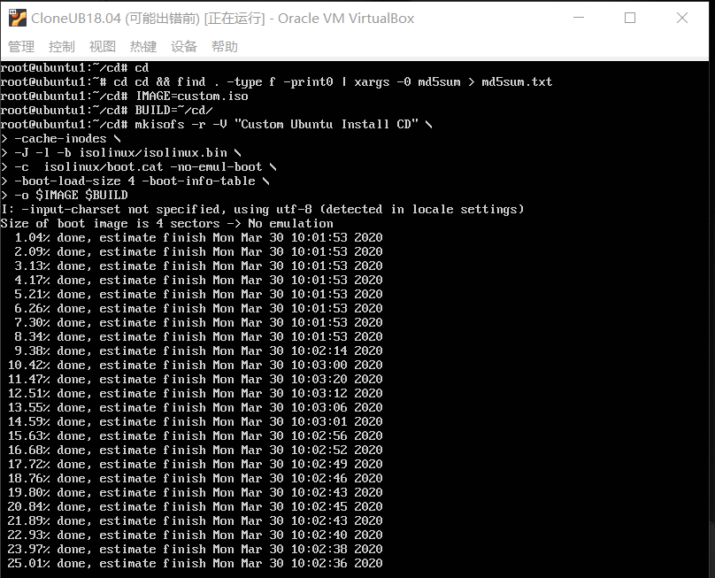  

* ##### 14. 用pscp下载镜像到主机D盘  

  ```pscp root@192.168.254.3:cd/custom.iso D:/```  
    
    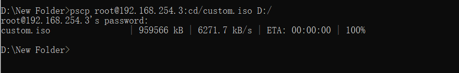  

* ##### 15.无人值守安装过程  
   视频： b站还在审核中，通过后会在https://space.bilibili.com/384560529 账号下。通过后我会把链接传上来。

* ##### 问题
    1. 最开始我在root@Ubuntu1/home/ann里创建loopdir和cd文件夹，后来到md5sum封装的步骤时报错/root/cd目录不存在。删掉了之前创建的文件夹回到root@Ubuntu1目录后重新创建文件夹、执行后续步骤后顺利封装。
    2. * 一个遗留问题
     最前面选择语言和键盘界面仍然需要手动点两下。但是定制文件里``` “# http://askubuntu.com/questions/129651/how-do-i-configure-a-preseed-to-skip-the-language-support-question d-i pkgsel/install-language-support boolean false”```语句应该是跳过了语言支持的选项。

#### 参考文件
https://blog.csdn.net/legend050709/article/details/41176947
https://blog.csdn.net/cmzhuang/article/details/80513965
https://blog.csdn.net/qq_43115981/article/details/94763239
https://askubuntu.com/questions/634501/cant-mount-iso-file-as-loop-device-error-failed-to-setup-loop-device  
https://www.cnblogs.com/yanggb/p/10904858.html  
https://www.itbulu.com/ubuntu-sources-list.html  
https://github.com/CUCCS/linux-2020-yumlii33  
https://github.com/CUCCS/linux-2019-PWHL/
